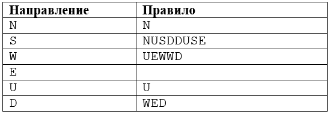

# [28. Космический мусорщик](Task.pdf)

В околоземном космическом пространстве накопилось много мусора, поэтому ученые сконструировали специальный аппарат – ловушку для космического мусора. Для того, чтобы хорошо собирать мусор, этот аппарат должен двигаться по достаточно сложной траектории, сжигая собранный по пути мусор. Ловушка может передвигаться в пространстве по 6 направлениям: на север (N), на юг (S), на запад (W), на восток (E), вверх (U) и вниз (D). Движением ловушки управляет процессор. Программа движения задается шестью правилами движения, которые соответствуют каждому из указанных направлений. Каждое такое правило представляет собой строку символов из множества N, S, W, E, U, D.

Команда ловушки есть пара из символа направления и параметра – целого положительного числа M. При исполнении такой команды ловушка в соответствии со своей программой выполняет следующее. Если параметр больше 1, то она перемещается на один метр в направлении, которое указано в команде, а затем последовательно выполняет команды, заданные правилом для данного направления, с параметром меньше на 1. Если же параметр равен 1, то просто перемещается на один метр в указанном направлении.

Пусть, например, заданы следующие правила:

Тогда при выполнении команды S(3) мусорщик выполнит следующие действия:

1. переместится на 1 метр в направлении S

2. выполнит последовательно команды N(2), U(2), S(2), D(2), D(2), U(2), S(2), E(2).

Если далее проанализировать действия мусорщика при выполнении команд из пункта 2, получим, что в целом он совершит следующие перемещения:

SNNUUSNUSDDUSEDWEDDWEDUUSNUSDDUSEE

По заданной команде определите, какое общее количество перемещений на один метр совершит ловушка при выполнении заданной команды. В приведенном примере это количество равно 34.