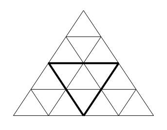

# [23. Количество треугольников](Task.pdf)

Рассмотрим фигуру, аналогичную показанной на рисунке (большой равносторонний треугольник, составленный из маленьких равносторонних треугольников). На рисунке приведена фигура, состоящая из 4-х уровней треугольников.

Напишите программу, которая будет определять, сколько всего в ней треугольников (необходимо учитывать не только «маленькие» треугольники, а вообще все треугольники — в частности, нас интересуют треугольник, выделенный жирным, вся фигура).