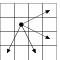

# [26. Ход конём - 2](Task.pdf)

Дана прямоугольная доска N × M (N строк и M столбцов). В левом верхнем углу находится шахматный конь, которого необходимо переместить в правый нижний угол доски.

При этом конь может ходить следующим образом:

Необходимо определить, сколько существует различных маршрутов, ведущих из левого верхнего в правый нижний угол.